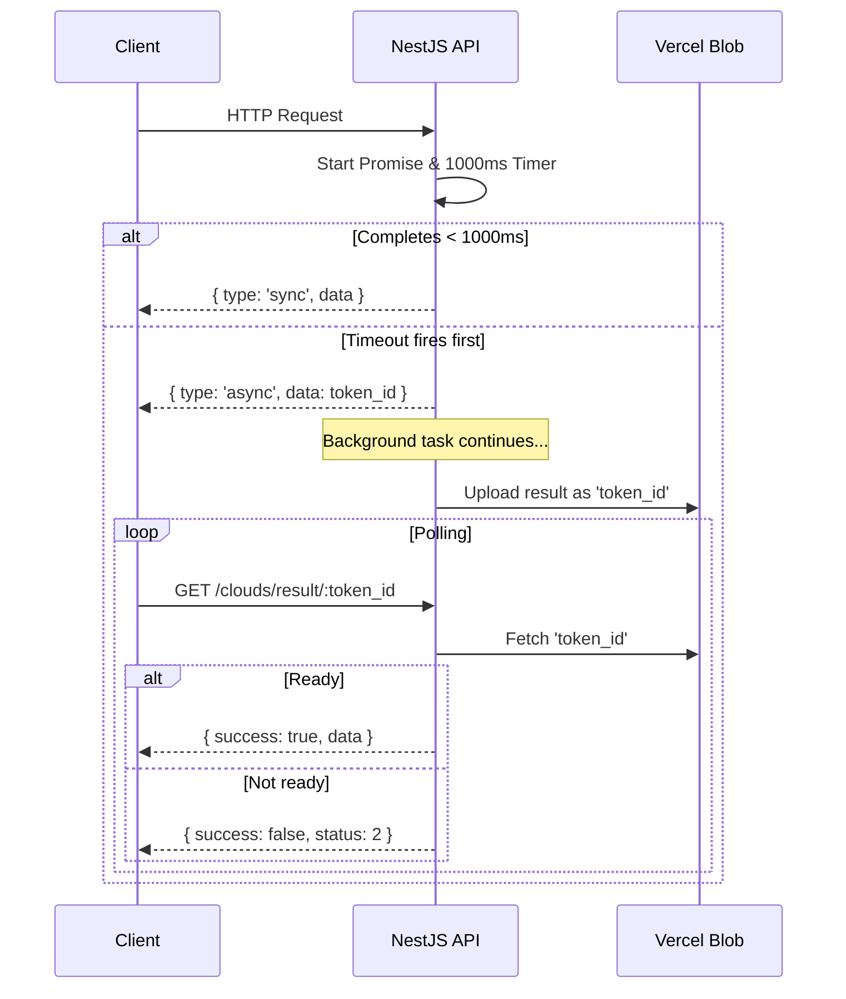

# Project Context: `api-me`

This file is the authoritative instruction set for AI agents working on this codebase.
Read it fully before making any changes. Do not deviate from the patterns described here.

---

## 1. Stack Overview

- **Framework:** NestJS (controller → service → module architecture)
- **Database ORM:** Prisma (`PrismaService`) — PostgreSQL
- **Cache:** Upstash Redis, accessed exclusively via `RedisReader`
- **Blob Storage:** Vercel Blob, accessed via `BlobService` (general) and `AsyncService` (polling)
- **Error Tracking:** Sentry (`@sentry/nestjs`)
- **Analytics:** PostHog, accessed via `AnalyticsService` → `PosthogService`
- **Media Downloading:** `mediasnap` (primary), `snapsave-adapter`, `highreach`, `nextdownloader` (proxy fallback), PhantomJS Cloud (headless fallback)

---

## 2. Key Entry Points

| File | Purpose |
|---|---|
| `src/main.ts` + `src/app.module.ts` | Application bootstrap |
| `prisma/schema.prisma` | Database schema — source of truth for all models |
| `src/instrument.ts` | Sentry initialization — imported before everything else |
| `src/memes/memes.service.ts` | Core meme scraping logic and failover chain |
| `src/clouds/clouds.service.ts` | Cloud processing, uses `AsyncService` pattern |
| `src/async/async.service.ts` | Hybrid sync/async polling wrapper |
| `src/common/helpers/redisReader.ts` | Redis access with instance rotation |
| `src/analytics/analytics.events.ts` | Enum of all trackable product events |
| `test/memes.e2e-spec.ts` | E2E tests with mocked external calls |
| `test/memes.sanity-spec.ts` | Sanity tests hitting live production backend |

---

## 3. Mandatory Coding Rules

### 3.1 Database
- Use `PrismaService` for all database queries.
- Do **not** use TypeORM repositories or raw SQL, even though TypeORM appears in `package.json`. It is not active.

### 3.2 Redis / Caching
- Never instantiate an Upstash Redis client directly.
- Always use `RedisReader` — it handles daily instance rotation transparently.
- Treat Redis as a **short-lived transient cache only**. Keys do not persist across days.
- Whenever a tracking account is modified (created, updated, deleted), invalidate the relevant cache key immediately using `invalidateCachedActiveAccounts` or `invalidateCacheRecentIncoming`.

### 3.3 Blob Storage
- Use `BlobService` for general object persistence.
- Use `AsyncService` for anything related to the polling pattern (see Section 4).

### 3.4 Error Tracking
- On any failure in a critical pipeline or scraper, call `Sentry.captureException(err)` or `Sentry.captureMessage(...)`.
- Always follow with `await Sentry.flush(1000)` before returning or throwing, to ensure the event is delivered in serverless environments.

### 3.5 Analytics
- Log key system events using `AnalyticsService`.
- Use only pre-defined event names from `src/analytics/analytics.events.ts`. Do not pass raw strings.

---

## 4. Hybrid Sync/Async Polling Pattern

Slow external operations (scraping, cloud calls) must not block the HTTP connection. Wrap them using `AsyncService.prepareResult(...)` which implements the following contract:

- If the operation completes **within 1000ms** → returns `{ type: 'sync', data }` immediately.
- If the operation takes **longer than 1000ms** → returns `{ type: 'async', data: token_id }` immediately. The task continues in the background and uploads its result to Vercel Blob under the key `token_id` when done.
- The client polls `/clouds/result/:id` to retrieve the result once ready.

**Rule:** Any slow scraper or external API call must be wrapped in `this.asyncService.prepareResult(...)`. See `CloudsService` and `MemesService` for reference implementations.

---

## 5. Meme Scraper Failover Chain

`MemesService.stealMeme()` attempts media extraction in this priority order:

1. **Direct libraries:** `mediasnap` → `snapsave-adapter` → `highreach`
2. **Proxy fallback:** `stealWithNextdownloader` — streams media through a custom proxy URL
3. **Headless fallback:** PhantomJS Cloud — executes scripts from `src/common/phantomScripts/` to automate download pages and scrape direct media URLs

**Rules when adding a new downloader:**
- Register it inside the failover sequence in `stealMeme()`, not as a standalone path.
- Before returning any URL list, filter out relative paths and any URL containing `/render`.

---

## 6. Game Score Anti-Tampering

Score submissions to `GameResultsController` require a cryptographic timestamp token `t`.

The token is validated by `GameResultsService.retokenize(t)` and **must be no more than 10 seconds old** at the time of submission. This prevents replay attacks and client-side score manipulation.

**Rule:** Never bypass or remove this validation when modifying game score endpoints.

---

## 7. Environment Variables

- Redis instances are configured as `UPSTASH_REDIS_REST_URL_1`, `UPSTASH_REDIS_REST_URL_2`, etc. `RedisReader` selects the active one automatically — do not hardcode an index.
- Do not add secrets or connection strings directly to source files. Use `.env` and NestJS `ConfigService`.

---

## 8. Testing

| Command | What it does |
|---|---|
| `npm run lint` | Lint check |
| `npm run format:check` | Prettier format check |
| `npm run validate` | Lint + format (run before committing) |
| `npm run test` | Unit tests |
| `npm run test:e2e` | E2E tests with mocked externals |
| `npm run test:sanity` | ⚠️ Hits **live production** at `https://api.vdovareize.me` — only run when production is stable and network is active |
